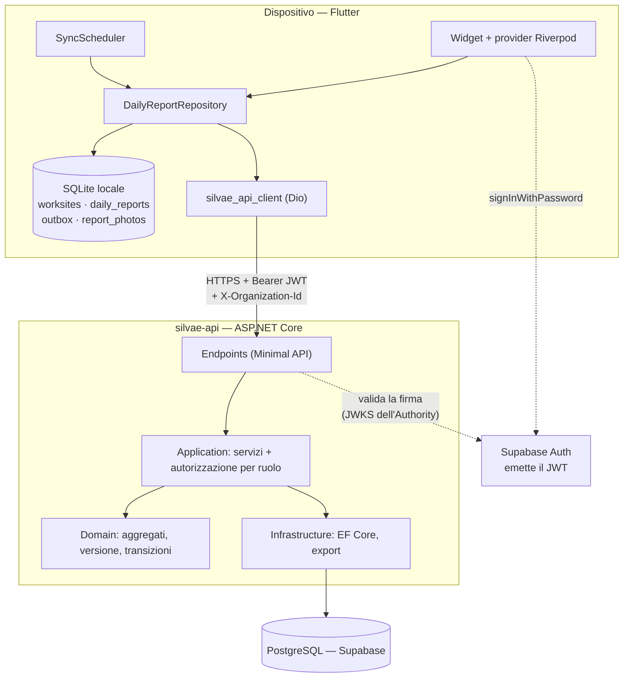
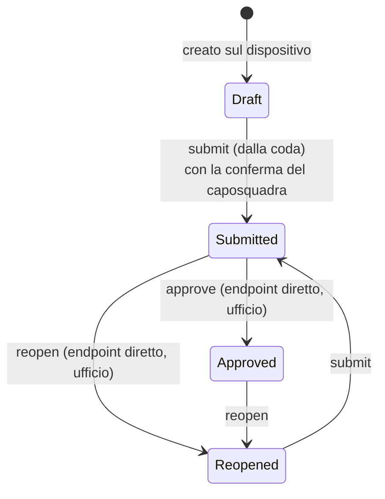
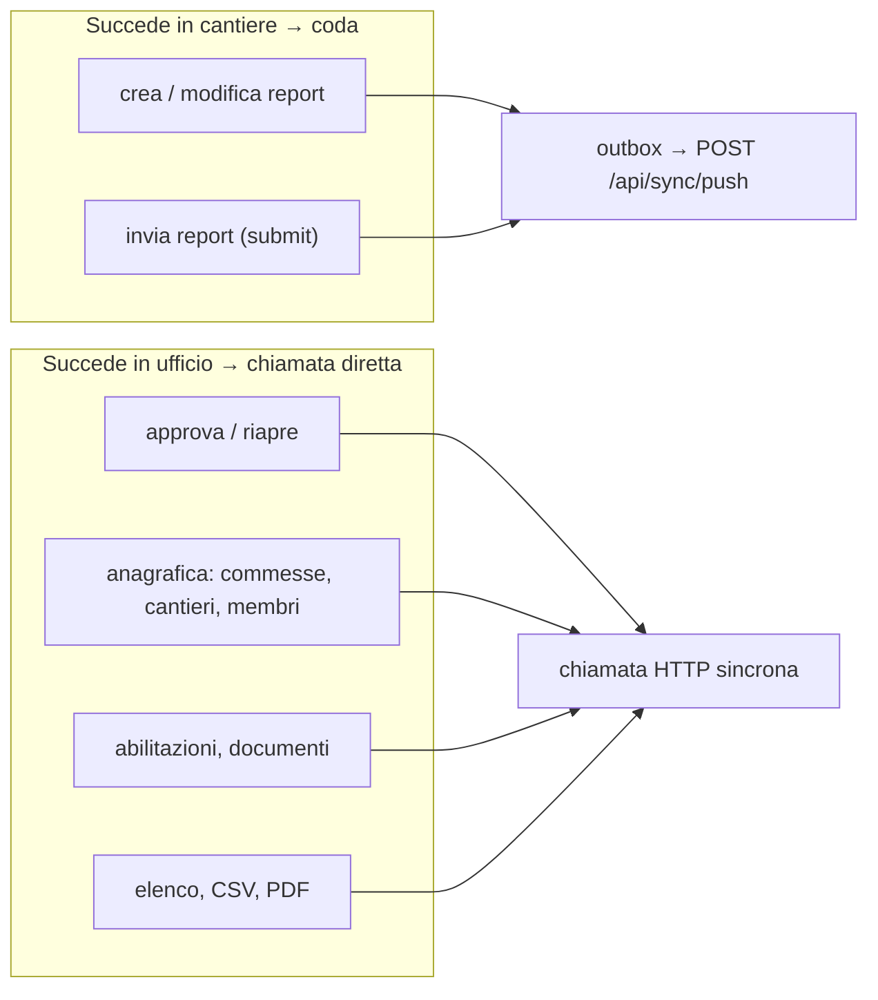
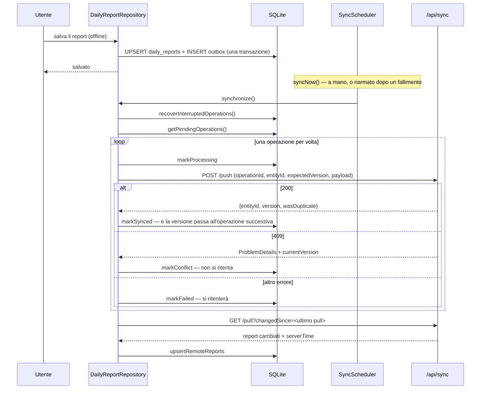
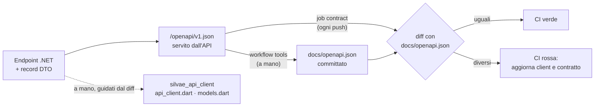
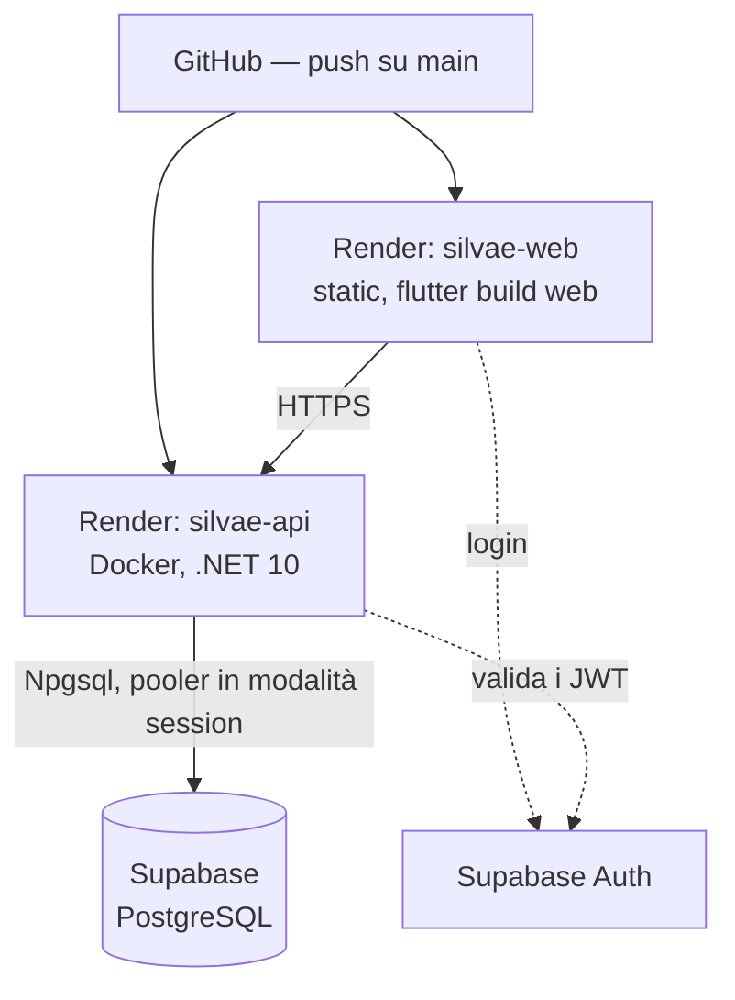

# Silvae — Architettura

Questo documento descrive Silvae **com'è oggi**, non come sarà. Serve a
riprendere il filo senza rileggere il codice: che cosa c'è, dove sta, come
parlano fra loro i pezzi e con quale procedura si aggiunge un endpoint.

Il piano con la roadmap è in [`implementation-plan.md`](implementation-plan.md);
le decisioni con la loro motivazione sono in [`adr/`](adr); il deploy è in
[`DEPLOYMENT.md`](DEPLOYMENT.md). Qui non si ripetono, si collegano.

> Nell'interfaccia e nel codice si dice **report**, non «rapportino». Gli ADR e
> le parti più vecchie del piano dicono ancora «rapportino»: è la stessa cosa.

---

## 1. Che cos'è

Piattaforma multi-tenant per cooperative e aziende che coordinano squadre in
cantieri di manutenzione verde e forestale. Sostituisce il foglio presenze
cartaceo con un ciclo che **funziona anche senza rete**: in cantiere il segnale
non c'è, quindi il salvataggio non può dipenderne.

Due mondi, un solo backend:

- **il cantiere** — l'operatore compila il report sul telefono, offline; quel
  che scrive va in una coda locale e sale quando la rete c'è;
- **l'ufficio** — coordinatori e amministratori cercano, approvano, esportano,
  tengono l'anagrafica e le abilitazioni.

---

## 2. Stack

| Strato | Tecnologia | Note |
| --- | --- | --- |
| App | Flutter (Android, iOS, Web) | Riverpod 3 per stato e DI; niente GoRouter, la navigazione è un `NavigationBar`/`NavigationRail` con `Navigator.push` per il dettaglio |
| Database locale | SQLite via `sqflite` | `sqflite_common_ffi` su desktop, `sqflite_common_ffi_web` **senza web worker** sul browser |
| Client HTTP | package Dart `silvae_api_client` **scritto a mano** su Dio | non generato: vedi §6 |
| Identità | Supabase Auth (`supabase_flutter`) | l'API **non emette** token, li valida soltanto |
| API | ASP.NET Core su .NET 10, Minimal API | monolite modulare (ADR 001) |
| ORM | EF Core + Npgsql | migrazioni applicate all'avvio con `MigrateAsync()` |
| Database | PostgreSQL gestito da Supabase | progetto `rodlenfqlzhuthbmgtrh` |
| Export | QuestPDF (PDF) + CSV scritto a mano | QuestPDF disegna con Skia: servono i font nel container |
| Hosting | Render (Blueprint `render.yaml`) | `silvae-api` in Docker, `silvae-web` statico |
| Test | xUnit, FluentAssertions, Testcontainers; `flutter test` | quattro job di CI |

Restano **non attivati** rispetto al piano: Supabase Storage, Firebase Cloud
Messaging, Drift, Freezed, il client Dart generato.

---

## 3. Il quadro d'insieme



Il client **non tocca mai** Postgres direttamente: ogni lettura e scrittura
passa dall'API, che è l'unico posto dove vive l'autorizzazione per ruolo.
(Oggi questo è un fatto di disciplina, non un vincolo: vedi §11.)

---

## 4. Il backend

### 4.1 I quattro progetti

```text
Silvae.Api            ← host: routing, autenticazione, CORS, middleware
   └── Silvae.Application  ← casi d'uso, autorizzazione, DTO, contratti sync
          ├── Silvae.Domain        ← aggregati e regole, nessuna dipendenza
          └── (Abstractions: ISilvaeStore, IRequestContext, IBootstrapSecret)
Silvae.Infrastructure ← EF Core (EfSilvaeStore, SilvaeDbContext), export CSV/PDF
```

Le dipendenze puntano verso il dominio. `Silvae.Application` non conosce EF: usa
`ISilvaeStore`, che `Silvae.Infrastructure` implementa con EF Core e i test
implementano in memoria (`InMemorySilvaeStore`). Per questo la gran parte dei
test dei casi d'uso gira senza database.

### 4.2 Aggregati

| Aggregato | File | Cosa custodisce |
| --- | --- | --- |
| `Organization` + `UserMembership` | `Domain/Organizations` | il tenant e i ruoli `Administrator`, `Coordinator`, `CrewLeader`, `Worker` |
| `JobOrder` | `Domain/JobOrders` | la commessa |
| `Worksite` + `WorksiteAssignment` | `Domain/Worksites` | il cantiere e chi ci lavora; il legame alla commessa è **facoltativo** |
| `DailyReport` | `Domain/DailyReports` | il report con squadra, lavorazioni, checklist, foto, firma, `Version`, audit |
| `Certification` | `Domain/People` | l'abilitazione, valida **su un intervallo** di date |
| `StoredDocument` | `Domain/Documents` | l'archivio, byte in Postgres, tetto 10 MB |

Il `DailyReport` è l'unico aggregato che si sincronizza. Porta una `Version`
`long` che sale a ogni modifica accettata: è il perno del controllo dei
conflitti.

### 4.3 Ciclo di vita del report



Ogni transizione lascia una riga di audit con chi l'ha fatta e quando (ADR 005).
La riapertura **cancella la firma**: copriva il contenuto di allora. La
correzione d'ufficio non ha un endpoint di modifica dedicato — si riapre, e il
report torna in mano al cantiere con la stessa schermata e la stessa coda.

### 4.4 Autenticazione e tenant

Non c'è login lato .NET. Il flusso è:

1. l'app chiama `signInWithPassword` su Supabase Auth e ottiene un JWT;
2. Dio lo mette in `Authorization: Bearer …` a ogni richiesta e aggiunge
   `X-Organization-Id`;
3. l'API valida la firma contro l'`Authority` Supabase (`AddJwtBearer`);
4. `HttpRequestContext` legge `sub` come `UserId` e l'organizzazione dalla claim
   `organization_id` o, in mancanza, dall'header;
5. `CurrentUserService` **rilegge la membership dal database**: il ruolo non
   arriva mai dal client.

L'header dice soltanto *quale* organizzazione, mai *con che diritti*. Se la
membership non esiste, la richiesta è 403.

L'autorizzazione applicativa sta in due posti:

- `RoleAuthorization` — anagrafica: `RequireRegistryManager` (Administrator o
  Coordinator), `RequireAdministrator` (soli membri e ruoli);
- `DailyReportAuthorization` — report: `IsOfficeRole` decide se si vede tutto o
  solo il proprio; `RequireCanEdit` lascia modificare l'autore o chi è in
  ufficio.

L'ultimo amministratore non si degrada e non si rimuove: senza amministratori
l'organizzazione si riaprirebbe solo con il segreto di deploy.

### 4.5 Gli errori

`ApiExceptionMiddleware` traduce le eccezioni applicative in
`ProblemDetails`, e `CorrelationIdMiddleware` marca la richiesta.

| Eccezione | Stato |
| --- | --- |
| `AuthenticationRequiredException` | 401 |
| `OrganizationAccessDeniedException`, `ResourceAccessDeniedException` | 403 |
| `ResourceNotFoundException` | 404 |
| `RegistryValidationException`, `SyncValidationException` | 400 |
| `RegistryConflictException` | 409 |
| `SyncConflictException` | 409 **+ `currentVersion` nelle extensions** |

Quell'ultima riga non è un dettaglio: è il modo in cui il dispositivo scopre su
quale versione riproporsi dopo un conflitto.

---

## 5. Come Flutter e .NET si parlano

### 5.1 I due canali

Non tutto passa dalla coda. La regola è **dove succede la cosa**:



Chi è in ufficio ha la rete; chi è in cantiere no. Un endpoint diretto per
l'approvazione è più semplice di una coda, e una coda per l'invio è l'unica cosa
che funziona sotto un bosco.

### 5.2 Le rotte

Tutte richiedono il Bearer token tranne `/api/health`.

| Metodo | Rotta | Chi |
| --- | --- | --- |
| GET | `/api/health` | pubblico |
| GET | `/api/me` | chiunque autenticato |
| POST | `/api/bootstrap/organization` | protetto da `SILVAE_BOOTSTRAP_SECRET` (ADR 004) |
| GET / PUT / DELETE | `/api/organization/members[/{userId}]` | Administrator |
| GET / POST / PATCH | `/api/job-orders[/{id}]` | Administrator, Coordinator |
| GET / POST / PATCH | `/api/worksites[/{id}]` | Administrator, Coordinator |
| PUT / DELETE | `/api/worksites/{id}/assignments/{userId}` | Administrator, Coordinator |
| GET | `/api/daily-reports` | filtri: `jobOrderId`, `worksiteId`, `crewUserId`, `from`, `to`, `status` |
| GET | `/api/daily-reports/export.csv` · `/export.pdf` | stessi filtri |
| GET | `/api/daily-reports/{id}` | autore o ufficio |
| POST | `/api/daily-reports/{id}/submit` · `/approve` · `/reopen` | submit anche dalla coda |
| GET / POST / PUT / DELETE | `/api/certifications[/{id}]` | + `/expiring`, `/inspection` |
| GET / POST / DELETE | `/api/documents[/{id}]` | + `/{id}/content` |
| POST | `/api/sync/push` | da 1 a 100 operazioni per richiesta |
| GET | `/api/sync/pull?changedSince=` | il delta dei report |

### 5.3 Il ciclo di sincronizzazione



Le cose che rendono questo ciclo non banale, tutte già costate un bug:

- **Idempotenza.** Il server tiene in `ProcessedSyncOperations` gli
  `operationId` già elaborati: un retry dopo una risposta persa ritorna lo
  stesso risultato con `wasDuplicate: true`, senza riapplicare nulla.
- **Le versioni si passano.** `synchronize()` legge la outbox tutta insieme, ma
  ogni push confermato alza la versione: l'operazione successiva sullo stesso
  report va inviata con la versione **appena prodotta**, sia in memoria dentro il
  ciclo sia sulle righe ancora in coda. Senza, ogni invio compilato offline dopo
  una modifica arriva in conflitto.
- **Le modifiche confluiscono.** Due `upsert` in coda sullo stesso report con la
  stessa versione attesa sono un conflitto garantito: la seconda modifica
  riscrive il payload dell'operazione già accodata invece di accodarne un'altra.
  Vale solo fra `upsert`; un `submit` già in coda viene dopo e resta dov'è.
- **Un 409 non si ritenta.** L'operazione esce dalla coda con stato `conflict` e
  decide una persona, scegliendo fra due versioni che sono **entrambe già sul
  dispositivo** — il pull mette da parte la copia del server invece di
  scartarla. Così la decisione si prende anche senza rete.
- **Nessun ascolto della connettività.** Un'interfaccia di rete attiva non dice
  che l'API sia raggiungibile; un tentativo riuscito lo dimostra. Il
  `SyncScheduler` ritenta con attesa che raddoppia da 15 s fino a 5 minuti,
  finché la outbox non è vuota.
- **Upsert sostituisce, non fonde.** Una lista assente dal payload significa
  «non toccare»; una lista presente, anche vuota, cancella (ADR 005).

### 5.4 Il database locale

| Tabella | A che serve |
| --- | --- |
| `worksites` | cache dei cantieri assegnati, per lavorare offline |
| `daily_reports` | i report; `content` è un JSON con squadra, lavorazioni, checklist, foto; `sync_status` vale `device`, `synced` o `conflict` |
| `outbox` | `operation_id`, `entity_id`, `entity_type`, `operation_type`, `expected_version`, `payload`, `attempts`, `last_error`, `status` |
| `report_photos` | i **byte** delle foto, `local_reference` come chiave |
| `sync_state` | l'istante dell'ultimo pull |

Lo schema dei test è quello dell'app: `LocalDatabase.createSchema` è pubblico
apposta, perché la copia scritta a mano che c'era prima si è scollegata al primo
campo aggiunto.

**Delle foto il server tiene solo la scheda** — riferimento locale, posizione,
istante, didascalia. I byte restano nel SQLite del dispositivo e non salgono
mai. Dall'ufficio non si vedono, e non si vedranno finché non esisterà il
caricamento su storage a oggetti.

---

## 6. Il flusso OpenAPI

Il contratto è prodotto dall'API, non scritto a mano, e non è generativo verso
il client: è **un controllo**.



`scripts/generate-api-client.sh` **non è utilizzabile**: il generatore
`dart-dio` produrrebbe un package `built_value` incompatibile con il client
scritto a mano, e romperebbe tutti i punti di chiamata. L'allineamento lo
garantisce il job `contract`, che avvia l'API, scarica il documento pubblicato e
lo confronta con quello committato: se differiscono, la CI si ferma. Il client
Dart lo si aggiorna a mano, ma nessuno può dimenticarsene in silenzio.

### Aggiungere un endpoint — la procedura

1. **Dominio** (se serve una regola nuova): metodo sull'aggregato in
   `Silvae.Domain`, con il test in `tests/Silvae.Domain.Tests`.
2. **Applicazione**: il caso d'uso nel servizio di sezione
   (`WorksiteService`, `DailyReportService`, …), il DTO come `record`, la
   chiamata all'autorizzazione per ruolo. Se servono dati nuovi, il metodo va
   dichiarato su `ISilvaeStore` e implementato in `EfSilvaeStore` **e** in
   `InMemorySilvaeStore`.
3. **API**: la rotta nel gruppo giusto sotto `Endpoints/`, con `.WithName(...)`
   — il nome finisce nell'`operationId` del contratto.
4. **Migrazione**, se il modello EF è cambiato: **incrementale**, mai
   rigenerata (vedi §9). In locale con `dotnet ef`, altrimenti col workflow
   `tools`.
5. **Contratto**: rigenerare `docs/openapi.json` col workflow `tools`, oppure in
   locale avviando l'API e salvando `/openapi/v1.json` formattato a due spazi.
6. **Client Dart**: aggiungere il metodo in `api_client.dart` e i DTO in
   `models.dart`, guidati dal diff del contratto.
7. **App**: usare il client da un repository o da un provider, mai da un widget.
8. **Test**: caso d'uso in `Silvae.Application.Tests`, giro completo in
   `Silvae.IntegrationTests` se l'endpoint ha una forma HTTP che conta
   (autorizzazione, byte di un export, stati).
9. **Verifica** con i comandi di §10.

---

## 7. L'app

### 7.1 Come è composta

```text
lib/
├── main.dart              legge SILVAE_* da --dart-define, avvia Supabase e il DB
├── app/
│   ├── dependencies.dart  i provider Riverpod: database, client, org, ruolo, repo, scheduler
│   ├── silvae_app.dart    root; segnala le variabili mancanti invece di morire
│   ├── theme.dart · ui.dart
├── core/
│   ├── auth/      AuthGateway (interfaccia) + SupabaseAuthGateway
│   ├── database/  LocalDatabase + apertura per piattaforma (io / web)
│   ├── network/   api_factory: Dio, base URL, Bearer, X-Organization-Id
│   ├── sync/      SyncScheduler
│   ├── photos/    scatto e georeferenziazione
│   └── files/     scelta e salvataggio file
└── features/<sezione>/{domain,data,presentation}
```

La configurazione è compile-time: `SILVAE_SUPABASE_URL`,
`SILVAE_SUPABASE_ANON_KEY`, `SILVAE_API_BASE_URL`, `SILVAE_ORGANIZATION_ID`,
passate con `--dart-define`. Se ne manca una, l'app lo dice a schermo.

### 7.2 Che cosa vede chi

La barra di navigazione cambia col ruolo letto da `/api/me`:

| Sezione | Worker / CrewLeader | Administrator / Coordinator |
| --- | --- | --- |
| **Report** — elenco, editor, conflitti | sì | sì |
| **Cantieri** — assegnati, con i documenti | sì | — |
| **Ufficio** — elenco filtrabile, approva, riapre, CSV, PDF | — | sì |
| **Anagrafica** — commesse, cantieri, assegnazioni, membri, documenti | — | sì |
| **Sicurezza** — abilitazioni, scadenze, estrazione per l'ispezione | — | sì |

Il ruolo qui decide **cosa si mostra**, non cosa si concede: quello lo decide il
backend, che il ruolo lo rilegge dalla membership a ogni richiesta.

### 7.3 L'editor del report

Squadra con le ore, lavorazioni con quantità e unità, checklist di sicurezza
(voci identificate da un codice, elenco costante in `daily_report.dart`), foto
geolocalizzate, note, e la conferma del caposquadra — che è **un nome digitato**,
non un disegno: una firma con valore legale è una decisione rinviata, e un
tratto a schermo non è più probante.

Sul conflitto, `conflict_dialog.dart` mostra le due versioni e chiede quale
tenere. Entrambe sono già sul dispositivo, quindi la scelta si fa anche in
mezzo al bosco.

---

## 8. Deploy



`render.yaml` crea entrambi i servizi. L'API applica `MigrateAsync()` all'avvio
— per questo la connection string deve usare la modalità *session* del pooler:
la modalità *transaction* non supporta le prepared statement. `/api/health` è
l'health check. Il Dockerfile installa `fontconfig` e `fonts-dejavu-core`,
altrimenti QuestPDF non ha font e l'export PDF muore.

Stato reale: il progetto Supabase esiste e ha lo schema migrato, con
un'organizzazione di prova (`ScottieOrgTest`) e un amministratore inseriti via
SQL. **Il frontend non è ancora stato ripubblicato con `SILVAE_ORGANIZATION_ID`
valorizzato su quella organizzazione**, quindi nessuno ha ancora visto il giro
completo con dati veri nel browser.

---

## 9. Codice generato e trappole

### Migrazioni EF — non si rigenerano più

Da quando esiste un ambiente pubblicato, sostituire una migrazione con una
rigenerata le dà un id nuovo: EF la crede da applicare, ricrea tabelle che
esistono già, l'avvio muore con `relation "organizations" already exists` e
Render tiene su l'istanza vecchia — il deploy sembra sano mentre serve codice di
ieri. È successo il 2026-08-26. **Ogni modifica al modello aggiunge una
migrazione incrementale.** Nessun job di CI copre questo caso: `container`
avvia senza connection string, gli altri partono da un database vuoto.

A impedire la deriva restano due controlli: `has-pending-model-changes` verifica
che modello e migrazioni coincidano, e il diff verifica il contratto.

### Le altre trappole

Sono elencate per esteso in [`../CLAUDE.md`](../CLAUDE.md); in sintesi:

- ogni `Id` `Guid` va dichiarato `ValueGeneratedNever()`, altrimenti EF prova un
  UPDATE al posto di un INSERT;
- nomi dei test in PascalCase (`CA1707` è un errore, non un avviso);
- Dart non si formatta a mano: `dart format` **riunisce** anche le righe;
- `flutter analyze` fallisce anche sui semplici `info`;
- sul web serve `databaseFactoryFfiWebNoWebWorker` e `web/sqlite3.wasm`;
- il `Dockerfile` deve copiare `.editorconfig`, che esenta le migrazioni dagli
  analizzatori;
- Riverpod 3 non ha più `StateProvider`: uno stato scrivibile è un
  `NotifierProvider`.

---

## 10. Verifica

```bash
dotnet build Silvae.sln && dotnet test Silvae.sln

cd src/mobile/silvae_app
dart format --output=none --set-exit-if-changed lib test ../silvae_api_client/lib
flutter analyze
flutter test
```

Quattro job in CI:

| Job | Che cosa prova |
| --- | --- |
| `backend` | build e test .NET su Postgres 17 |
| `contract` | modello EF ≡ migrazioni; contratto pubblicato ≡ `docs/openapi.json` |
| `mobile` | formattazione, `flutter analyze`, `flutter test` |
| `container` | build dell'immagine e risposta su `/api/health` |

---

## 11. Quello che non c'è ancora

Da tenere davanti agli occhi prima di mostrare Silvae a qualcuno.

- **RLS disabilitata su Supabase.** Tutte le tabelle sono esposte alla chiave
  pubblica `sb_publishable_`, che sta nel bundle web: chi la prende può
  interrogare Postgres direttamente, **bypassando tutta l'autorizzazione per
  ruolo dell'API**. Servono delle policy — verosimilmente «deny all» su
  `anon`/`authenticated`, dato che l'unico accesso legittimo passa dalla
  connection string dell'API — prima di esporre l'app.
- **Nessun modo di provare in locale.** Senza Supabase non esiste un'identità:
  servirebbe un'autenticazione di sviluppo ristretta a `Development`.
- **Le foto non salgono.** Restano sul dispositivo; dall'ufficio non si vedono.
- **I documenti stanno in Postgres**, con un tetto di 10 MB. Entrambe le cose
  cambiano quando arriverà lo storage a oggetti.
- **La checklist di sicurezza è una costante**, uguale per tutte le
  organizzazioni: non esiste ancora una checklist per organizzazione che dica
  quali voci siano obbligatorie.
- **Il tracciato della rendicontazione** (CSV e PDF, una riga per persona e
  giornata) ricalca il foglio cartaceo ma non è stato confrontato con chi lo
  compila oggi in cooperativa.
- **Inviti, notifiche push, pianificazione**: Milestone 4, non iniziata.
